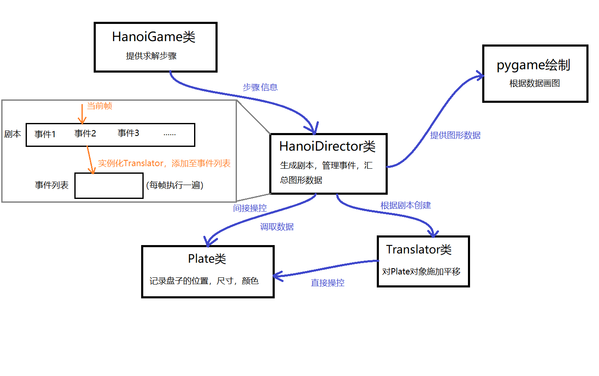

# HanoiAnimation
A python program to generate animation of solving Hanoi with n plates.

# HanoiAnimation说明手册

## 程序目的

自动生成求解汉诺塔过程的2D动画，可以指定盘子数量n。底座尺寸固定，盘子的尺寸和颜色根据n的取值自动适应。

## 编程技术路线 （详细过程见“开发过程与单元测试.ipynb”）

### 图形库：pygame

实现此动画并不需求很强的性能，所以没有选择vispy，而是选了更简单易用的pygame。

整个动画只用到pygame.draw.rect这一种图形，所有物体都由矩形来表示。

pygame做动画逻辑很简单：1.初始化模块；2.创建窗口；3.启动主循环，在其中画几何图形并刷新屏幕。所以剩下要做的就是生成动画中各个物体的矩形数据，要求随着主循环的进行，盘子的位置按照设计路线变化。

HanoiAnimation代码中pygame的部分学习自网络视频： 
https://www.youtube.com/watch?v=AY9MnQ4x3zk

本程序只用到了非常基本的部分。

### 汉诺塔求解

求解方式采用最简单，易实现的递归法。首先在HanoiDirector.HanoiGame类中实现递归求解函数，并记录操作流程。

同时为了记录游戏的状态，用HanoiDirector.Stack来记录每个杆子上的盘子。汉诺塔只能移动最上面的盘子，这个特性和栈非常契合。

有了状态记录，就可以确定每一步移动了哪个盘子，从哪个杆移动到哪个杆。这些是生成动画必要的数据。此功能由HanoiGame类中的step函数，每调用一次就输出一个操作。

### Plate类：记录每个盘子的位置

记录盘子的信息，包括位置，大小，颜色。实现平移函数，输入位移值可以改变位置。这个类更像是一个数据结构体。

### Translator类：针对一个Plate的平移事件

定义一个平移事件，针对一个Plate，持续一定的帧数，最终实现一定量的位移。平移过程使用线性插值。

将Translator对象放入pygame的主循环中，即可实现让某个盘子移动一定距离。

### HanoiDirector类：程序核心

HanoidDirector需要根据HanoiGame生成的求解过程写出剧本，管理每个盘子的运动，在每个阶段做出正确的操作。

此类是游戏求解和游戏图形的连接点。需要把求解的操作转化为可以绘制的图像数据。

**实现思路：**

1.生成n个Plate类，为它们设定自适应的初值（位置，尺寸，颜色）。 
2.根据给定参数生成底座的图像数据。 
3.维护一个计数器记录当前帧数，根据求解操作生成剧本，剧本记录了当前帧应该对哪个盘子实施何种平移操作。每次循环，导演需要把剧本记录的事件生成对应的Translator，并添加到事件列表中。 
4.执行事件列表中的每一个事件，每次一步。Translator在完成后会自动停止，导演就可以将其清出事件列表。 

## 设计图

## 程序运行方式

**需要用到的包：numpy, pygame**

可以使用python -m pip install pygame来安装pygame，若遇到问题，可参考pygame官网https://www.pygame.org/wiki/GettingStarted

**运行命令**

在console中使用

python HanoiAnimation.py -n 4 --fps 30 --fpe 20

其中-n参数为盘子的总数；--fps参数为动画的帧率，越高则动画速度越快；--fpe参数为每个动作持续的帧数，越高则运动越慢，越平滑（注意不要调到50以上，因为像素画面均为整数坐标，太高了无法完成插值）

以上三个参数的默认值分别为：3，20，10

**运行结果**

正确结果应为汉诺塔求解动画，参照视频“成果展示.mp4”

## 代码来源

HanoiDirector.py中的所有代码均是自主完成；HanoiAnimation中使用argparse做参数解析的部分参照自GitHub，pygame绘制部分参照之前提到的视频教程，剩余为自主完成。
